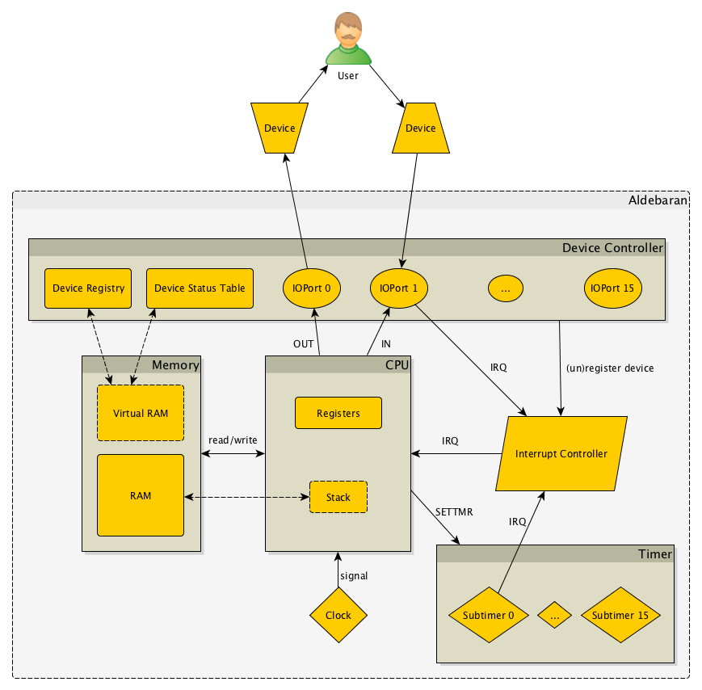
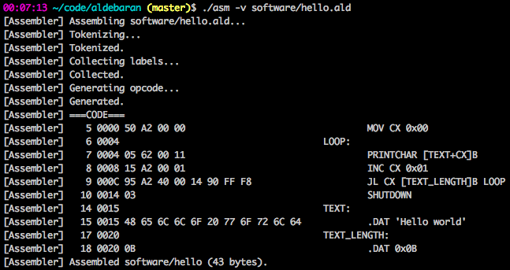
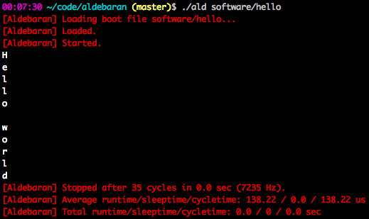

# Aldebaran

Aldebaran is a 16-bit computer with 64kB RAM emulated in Python.

The specs are partly based on the IBM PC XT, but mostly follow my own design, based on ideas coming from various sources. In spite of the totally inefficient technology (namely Python) it reached the blazing speed of 10-15 kHz on a Macbook Air.

The project is under construction: the architecture, the instruction set and the assembly language are not final/ready yet. Not to mention the missing devices, operating system or high-level language.

## Architecture

## Screenshots

Assemble source code to executable:

Run executable:

## How does it work?

- [Overview](docs/overview.md)
- [How does it work?](docs/how-does-it-work.md)
- [Assembly language](docs/assembly.md)
- [Instruction set](docs/instruction-set.md)
- [Opcode structure](docs/opcode-structure.md)
- [System config](docs/system-config.md)

## How can you play with it?

- [How to install](docs/how-to-install.md)
- [How to use](docs/how-to-use.md)
