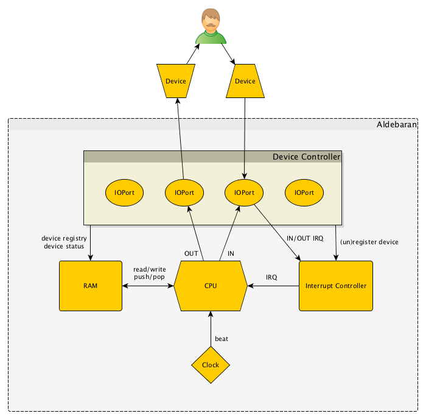

# Aldebaran

Aldebaran (ALD) is a 16-bit computer with 64kB RAM emulated in Python.

The specs are partly (from a large distance) based on the IBM PC XT. In spite of the totally inefficient technology (namely Python) it reached the blazing speed of 10-15 kHz on a Macbook Air.

The project is under heavy construction...

## Architecture

### Clock

### RAM

### CPU

### Interrupt Controller

### Device Controller and IOPorts

#### Input scenario

1. Device sends signal to Device Controller
2. Device Controller forwards it to the targeted IOPort
3. IOPort stores the data in its input buffer and calls an `ioport_in` interrupt
4. CPU calls the specified interrupt handler routine
5. The routine uses the `IN` instruction to read the content of the input buffer into RAM
6. IOPort asks Device Controller to send an `ACK` signal to the device
7. Device Controller sends an `ACK` signal to the device

#### Output scenario

1. The `OUT` instruction send a piece of RAM to an IOPort
2. IOPort asks Device Controller to send the data to the device
3. Device Controller sends the data to the device
4. Device Controller puts the status of the device into RAM and calls an `ioport_out` interrupt
5. CPU calls the specified interrupt handler routine
6. The routine checks the Device Status Table in RAM to see the device's status

### Registering/unregistering devices

1. Device sends signal to Device Controller
2. Device Controller registers/unregisters the device with the specified IOPort
3. Device Controller registers/unregisters the device into the Device Registry in RAM
4. Device Controller calls the `device_registered` or `device_unregistered` interrupt
5. CPU calls the specified interrupt handler routine
6. Device Controller responds to the device

## Programming

### Opcode structure

### Instruction set

