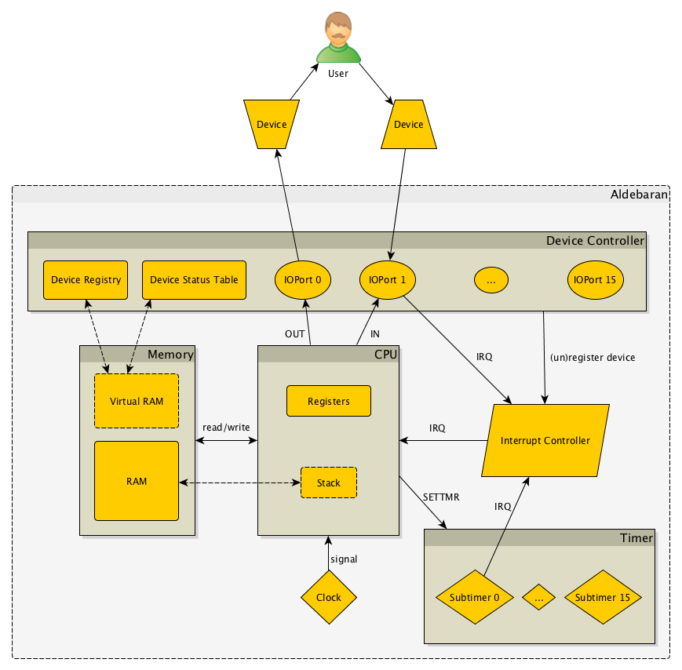

# Overview

## Architecture

## Components

### Clock

The clock sends the CPU a signal every `1/clock_freq` seconds. If it takes more time for the CPU to execute the instruction at hand, the clock will wait and send the next signal as soon as possible. So the effective clock frequency (printed after Aldebaran shuts down) is typically smaller than the theoretical. If `clock_freq` is zero ("TURBO" mode), the clock sends signals as fast as possible.

### RAM

A simple RAM module with 65536 bytes of storage. Capable of reading and writing bytes or words. The stack is stored in the RAM but it's implemented by the CPU.

### CPU

For every clock signal the CPU:

- checks if there's a hardware interrupt coming from the Interrupt Controller (only if the Interrupt Flag is set)
- if yes, it calls the specified interrupt handler routine (based on the Interrupt Vector Table)
- if no, it executes the instruction at the Instruction Pointer (`IP`) and sets the `IP` to the next instruction

The CPU has the following registers:

- 4 generic 16-bit registers: `AX`, `BX`, `CX`, `DX` (with separate lower and upper parts)
- `SP`: Stack Pointer for stack operations
- `BP`: Base Pointer for either using as a frame pointer in the call stack or for generic usage
- `SI`, `DI`: Source and Destination Index registers for either string operations or for generic usage
- `IP`: Instruction Pointer for control flow
- Interrupt Flag: to enable and disable hardware interrupts

### Interrupt Controller

The Interrupt Controller accepts hardware interrupts from internal devices (currently: Device Controller and Timer) and puts them into a FIFO queue. The CPU can take interrupts out of the queue and handle them.

Interrupt numbers (00-FF) are mapped to interrupt handler routines based on the Interrupt Vector Table (a 256 times 2 bytes part of the RAM).

Software interrupts are called by the CPU directly with the `INT` instruction.

### Device Controller and IOPorts

The Device Controller contains 16 IOPorts each capable of communicating with a separate device (via HTTP). The Device Controller handles the slow "physical" (i.e. network) connection to the devices. The IOPorts work fast: they respond to requests from the CPU (`IN` and `OUT` instructions) immediately.

When a new device is connected, first it's registered with an IOPort and into the so called Device Registry. The Device Registry is a part of the RAM. For each IOPort it has 4 bytes:

- 1 byte Device Type (00 if no device is registered)
- 3 bytes Device ID (000000 if no device is registered)

Another part of the RAM is the Device Status Table. For each IOPort it has 1 byte that is the status of the last `OUT` instruction. 0 if it was successful, 1 otherwise.

### Timer

Timer is an internal device (i.e. it's not controlled by the Device Controller but directly by the CPU). It runs on a preset frequency (`timer_freq`) independently from the clock and increases a step counter (`step_count`) at every beat. It has 16 subtimers that can be programmed separately with the `SETTMR` instruction.

A subtimer can be in 3 modes:

- `OFF` (`00`): the subtimer does nothing
- `ONESHOT` (`01`): the subtimer waits until `step_count % speed = phase`, then it calls a specified interrupt and switches to `OFF` mode
- `PERIODIC` (`02`): the subtimer waits until `step_count % speed = phase`, then it calls a specified interrupt and waits again

If `speed` is zero, a `ONESHOT` subtimer calls the interrupt at the next beat of the Timer, a `PERIODIC` calls at every beat. In this case `phase` has no meaning. Otherwise `phase` should be between `0` and `speed-1`.
